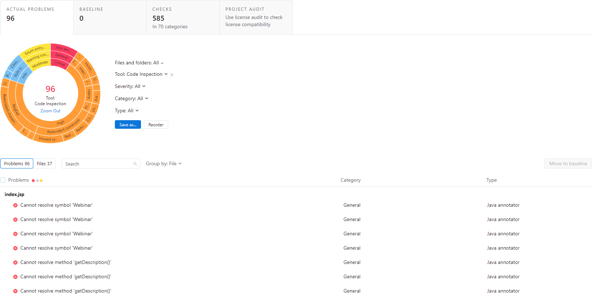

# Coder Gateway Plugin 

[](https://discord.gg/coder)
[](https://twitter.com/coderhq)
[](https://github.com/coder/coder-jetbrains/actions/workflows/build.yml)

<!-- Plugin description -->
**Coder Gateway** connects your Jetbrains IDE to your [Coder Workspaces](https://coder.com/docs/coder-oss/latest/workspaces) so that you can develop from anywhere.

**Manage less**

- Ensure your entire team is using the same tools and resources
- Keep your source code and data behind your firewall

**Code more**

- Build and test faster
    - Leveraging cloud CPUs, RAM, network speeds, etc.
- Access your environment from any place
- Onboard instantly then stay up to date continuously

<!-- Plugin description end -->

## Getting Started

To manually install a local build:

1. Install [Jetbrains Gateway](https://www.jetbrains.com/help/phpstorm/remote-development-a.html#gateway)
2. run `./gradlew clean buildPlugin` to generate a zip distribution
3. locate the zip file in the `build/distributions` folder and follow [these instructions](https://www.jetbrains.com/help/idea/managing-plugins.html#install_plugin_from_disk) on how to install a plugin from disk.

Alternatively, `./gradlew clean runIde` will deploy a Gateway distribution (the one specified in `gradle.properties` - `platformVersion`) with the latest plugin changes deployed.

### Plugin Structure

```
├── .github/                GitHub Actions workflows and Dependabot configuration files
├── gradle
│   └── wrapper/            Gradle Wrapper
├── build/                  Output build directory
├── src                     Plugin sources
│   └── main
│       ├── kotlin/         Kotlin production sources
│       └── resources/      Resources - plugin.xml, icons, i8n
│   └── test
│       ├── kotlin/         Kotlin test sources
├── .gitignore              Git ignoring rules
├── build.gradle.kts        Gradle configuration
├── CHANGELOG.md            Full change history
├── gradle.properties       Gradle configuration properties
├── gradlew                 *nix Gradle Wrapper script
├── gradlew.bat             Windows Gradle Wrapper script
├── qodana.yml              Qodana profile configuration file
├── README.md               README
└── settings.gradle.kts     Gradle project settings
```

`src` directory is the most important part of the project, the Coder Gateway  implementation and the manifest for the plugin – [`plugin.xml`](src/main/resources/META-INF/plugin.xml).

### Gradle Configuration Properties

The project-specific configuration file [`gradle.properties`](gradle.properties) contains:

| Property name               | Description                                                                                                   |
| --------------------------- |---------------------------------------------------------------------------------------------------------------|
| `pluginGroup`               | Package name, set to `com.coder.gateway`.                                                                     |
| `pluginName`                | Zip filename.                                                                                                 |
| `pluginVersion`             | The current version of the plugin in [SemVer](https://semver.org/) format.                                    |
| `pluginSinceBuild`          | The `since-build` attribute of the `<idea-version>` tag. The minimum Gateway build supported by the plugin    |
| `pluginUntilBuild`          | The `until-build` attribute of the `<idea-version>` tag. Supported Gateway builds, until & not inclusive      |
| `platformType`              | The type of IDE distribution, in this GW.                                                                     |
| `platformVersion`           | The version of the Gateway used to build&run the plugin.                                                      |
| `platformDownloadSources`   | Gateway sources downloaded while initializing the Gradle build. Note: Gateway does not have open sources      |
| `platformPlugins`           | Comma-separated list of dependencies to the bundled Gateway plugins and plugins from the Plugin Repositories. |
| `javaVersion`               | Java language level used to compile sources and generate the files for - Java 11 is required since 2020.3.    |
| `gradleVersion`             | Version of Gradle used for plugin development.                                                                |

The properties listed define the plugin itself or configure the [gradle-intellij-plugin](https://github.com/JetBrains/gradle-intellij-plugin) – check its documentation for more details.

### Testing

No functional or UI tests are available yet.

### Code Monitoring

Code quality is monitored with the help of [Qodana](https://www.jetbrains.com/qodana/)

Qodana inspections are accessible within the project on two levels:

- using the [Qodana IntelliJ GitHub Action][docs:qodana-github-action], run automatically within the [Build](.github/workflows/build.yml) workflow,
- with the [Gradle Qodana Plugin](https://github.com/JetBrains/gradle-qodana-plugin), so you can use it on the local environment or any CI other than GitHub Actions.

Qodana inspection is configured with the `qodana { ... }` section in the [Gradle build file](build.gradle.kts) and [`qodana.yml`](qodana.yml) YAML configuration file.

> **NOTE:** Qodana requires Docker to be installed and available in your environment.

To run inspections, you can use a predefined *Run Qodana* configuration, which will provide a full report on `http://localhost:8080`, or invoke the Gradle task directly with the `./gradlew runInspections` command.

A final report is available in the `./build/reports/inspections/` directory.



### Plugin compatibility

`./gradlew runPluginVerifier` can check the plugin compatibility against the specified Gateway. The integration with Github Actions is commented until [this gradle intellij plugin issue](https://github.com/JetBrains/gradle-intellij-plugin/issues/1027) is fixed.

## Continuous integration

In the `.github/workflows` directory, you can find definitions for the following GitHub Actions workflows:

- [Build](.github/workflows/build.yml)
  - Triggered on `push` and `pull_request` events.
  - Runs the *Gradle Wrapper Validation Action* to verify the wrapper's checksum.
  - Runs the `verifyPlugin` and `test` Gradle tasks.
  - Builds the plugin with the `buildPlugin` Gradle task and provides the artifact for the next jobs in the workflow.
  - ~~Verifies the plugin using the *IntelliJ Plugin Verifier* tool.~~ (this is commented until [this issue](https://github.com/JetBrains/gradle-intellij-plugin/issues/1027) is fixed)
  - Prepares a draft release of the GitHub Releases page for manual verification.
- [Release](.github/workflows/release.yml)
  - Triggered on `Publish release` event.
  - Updates `CHANGELOG.md` file with the content provided with the release note.
  - Publishes the plugin to JetBrains Marketplace using the provided `PUBLISH_TOKEN`.
  - Sets publish channel depending on the plugin version, i.e. `1.0.0-beta` -> `beta` channel.
  - Patches the Changelog and commits.

### Release flow

When the main branch receives a new pull request or a direct push, the [Build](.github/workflows/build.yml) workflow runs builds the plugin and prepares a draft release.

The draft release is a working copy of a release, which you can review before publishing.
It includes a predefined title and git tag, the current plugin version, for example, `v2.1.0`.
The changelog is provided automatically using the [gradle-changelog-plugin][gh:gradle-changelog-plugin].
An artifact file is also built with the plugin attached. Every new Build overrides the previous draft to keep the *Releases* page clean.

When you edit the draft and use the <kbd>Publish release</kbd> button, GitHub will tag the repository with the given version and add a new entry to the Releases tab.
Next, it will notify users who are *watching* the repository, triggering the final [Release](.github/workflows/release.yml) workflow.

### Plugin signing

Plugin Signing is a mechanism introduced in the 2021.2 release cycle to increase security in [JetBrains Marketplace](https://plugins.jetbrains.com).

JetBrains Marketplace signing is designed to ensure that plugins are not modified over the course of the publishing and delivery pipeline.

The plugin signing configuration is disabled for coder-gateway. To find out how to generate signing certificates and how to configure the signing task,
check the [Plugin Signing][docs:plugin-signing] section in the IntelliJ Platform Plugin SDK documentation.

### Publishing the plugin

[gradle-intellij-plugin][gh:gradle-intellij-plugin-docs] provides the `publishPlugin` Gradle task to upload the plugin artifacts. The [Release](.github/workflows/release.yml) workflow
automates this process by running the task when a new release appears in the GitHub Releases section.

> **Note**
>
> Set a suffix to the plugin version to publish it in the custom repository channel, i.e. `v1.0.0-beta` will push your plugin to the `beta` [release channel][docs:release-channel].

The authorization process relies on the `PUBLISH_TOKEN` secret environment variable, specified in the _Secrets_ section of the repository _Settings_.

You can get that token in your JetBrains Marketplace profile dashboard in the [My Tokens][jb:my-tokens] tab.

## Changelog maintenance

When releasing an update, it is essential to let users know what the new version offers.
The best way to do this is to provide release notes.

The changelog is a curated list that contains information about any new features, fixes, and deprecations.
When they are provided, these lists are available in a few different places:

- the [CHANGELOG.md](./CHANGELOG.md) file,
- the [Releases page][gh:releases],
- the *What's new* section of JetBrains Marketplace Plugin page,
- and inside the Plugin Manager's item details.

Coder Gateway follows the [Keep a Changelog][keep-a-changelog] approach for handling the project's changelog.

The [Gradle Changelog Plugin][gh:gradle-changelog-plugin] takes care of propagating information provided within the [CHANGELOG.md](./CHANGELOG.md) to the [Gradle IntelliJ Plugin][gh:gradle-intellij-plugin].
You only have to take care of writing down the actual changes in proper sections of the `[Unreleased]` section.

You start with an almost empty changelog:

```
# YourPlugin Changelog

## [Unreleased]
### Added
- Initial scaffold created from [IntelliJ Platform Plugin Template](https://github.com/JetBrains/intellij-platform-plugin-template)
```

Now proceed with providing more entries to the `Added` group, or any other one that suits your change the most (see [How do I make a good changelog?][keep-a-changelog-how] for more details).

When releasing a plugin update, you don't have to care about bumping the `[Unreleased]` header to the upcoming version – it will be handled automatically on the Continuous Integration (CI) after you publish your plugin.
GitHub Actions will swap it and provide you an empty section for the next release so that you can proceed with the development:

```
# YourPlugin Changelog

## [Unreleased]

## [0.0.1]
### Added
- An awesome feature

### Fixed
- One annoying bug
```

[docs:qodana-github-action]: https://www.jetbrains.com/help/qodana/qodana-intellij-github-action.html

[docs:plugin-signing]: https://plugins.jetbrains.com/docs/intellij/plugin-signing.html?from=IJPluginTemplate

[docs:release-channel]: https://plugins.jetbrains.com/docs/intellij/deployment.html?from=IJPluginTemplate#specifying-a-release-channel

[gh:gradle-changelog-plugin]: https://github.com/JetBrains/gradle-changelog-plugin

[gh:gradle-intellij-plugin]: https://github.com/JetBrains/gradle-intellij-plugin

[gh:gradle-intellij-plugin-docs]: https://plugins.jetbrains.com/docs/intellij/tools-gradle-intellij-plugin.html

[gh:releases]: https://github.com/coder/coder-jetbrains/releases

[jb:my-tokens]: https://plugins.jetbrains.com/author/me/tokens

[keep-a-changelog]: https://keepachangelog.com

[keep-a-changelog-how]: https://keepachangelog.com/en/1.0.0/#how